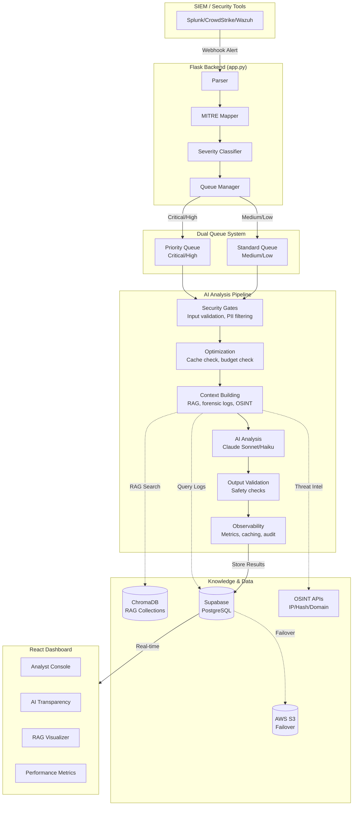

# AI-SOC Watchdog

A prototype tool that helps SOC analysts triage security alerts faster using AI. It takes alerts from SIEM systems, enriches them with context (logs, threat intel, MITRE ATT&CK mapping), sends them to Claude for analysis, and displays results on a dashboard.

Built as a portfolio/demo project. Not production-ready.


## What it does

The system receives security alerts, pulls in relevant forensic logs and threat intelligence, queries a RAG knowledge base (MITRE ATT&CK, historical alerts, business rules), and asks Claude to analyze everything. It returns a verdict with reasoning that analysts can review and override.

Analysts can provide feedback on AI decisions, which gets stored for context. The dashboard shows the AI's reasoning, what evidence it used, and lets analysts add notes.

## Architecture



See [docs/ARCHITECTURE.md](docs/ARCHITECTURE.md) for more details.

## Features

**AI Analysis:** Input/output validation, PII filtering, prompt injection detection. Uses RAG with ChromaDB for MITRE ATT&CK tactics, historical alerts, and business rules. OSINT lookups for IP/hash/domain reputation.

**Cost Management:** Routes critical alerts to Claude Sonnet, low-priority to Haiku. Caches responses to avoid duplicate API calls.

**Infrastructure:** S3 failover if Supabase goes down. Dual queue system prioritizes critical alerts. Background workers with status tracking.

**Dashboard:** Alert triage console, AI reasoning transparency view, RAG usage visualizer, performance metrics, live debug logs.

## Quick Start

### Prerequisites

Python 3.9+, Node.js 18+, Supabase account, Anthropic API key

### Setup

```bash
git clone https://github.com/YOUR_USERNAME/ai-soc-watchdog.git
cd ai-soc-watchdog

# Backend
pip install -r requirements.txt

# Frontend
cd soc-dashboard && npm install && cd ..
```

Create `.env` in project root:

```env
ANTHROPIC_API_KEY=your_key
SUPABASE_URL=your_url
SUPABASE_KEY=your_anon_key
SUPABASE_SERVICE_KEY=your_service_key

# Optional (S3 failover)
AWS_ACCESS_KEY=your_key
AWS_SECRET_KEY=your_secret
AWS_REGION=us-east-1
S3_BUCKET=your_bucket
```

Seed the RAG knowledge base:

```bash
python backend/scripts/seeding/seed_rag.py
```

### Run

```bash
# Terminal 1
python app.py

# Terminal 2
cd soc-dashboard && npm run dev
```

Or use the launcher script:

```bash
python scripts/utilities/master_launch.py
```

Open `http://localhost:5173`

## 🧪 Testing

```bash
python tests/run_all_tests.py --all    # All tests
python tests/run_all_tests.py --quick  # Skip API tests
python tests/run_all_tests.py --api    # API tests only
```

## API Endpoints

| Endpoint | Method | Description |
|----------|--------|-------------|
| `/ingest` | POST | Receive alerts from SIEM |
| `/alerts` | GET | List alerts |
| `/api/alerts/<id>` | PATCH | Update alert |
| `/api/alerts/<id>/feedback` | POST | Submit feedback on AI verdict |
| `/api/alerts/<id>/reanalyze` | POST | Re-queue for analysis |
| `/queue-status` | GET | Queue status |
| `/api/rag/stats` | GET | RAG statistics |
| `/api/transparency/proof/<id>` | GET | AI analysis proof |
| `/api/monitoring/metrics/dashboard` | GET | System metrics |

## Tech Stack

**Backend:** Python, Flask, Supabase (PostgreSQL)  
**Frontend:** React, Vite, TailwindCSS, Recharts  
**AI:** Anthropic Claude (Sonnet/Haiku)  
**Knowledge Base:** ChromaDB  
**Cloud:** AWS S3 (failover), Supabase

## Limitations

This is a prototype. It assists analysts but doesn't replace them. Accuracy depends on log quality. Requires Anthropic API availability. Analysis only—doesn't take automated response actions.

See [docs/TECHNICAL_DIFFERENTIATORS_AND_LIMITATIONS.md](docs/TECHNICAL_DIFFERENTIATORS_AND_LIMITATIONS.md) for details.

## Docs

Additional documentation in the `docs/` folder covers the complete alert flow, manual testing, and technical details.

## License

MIT
