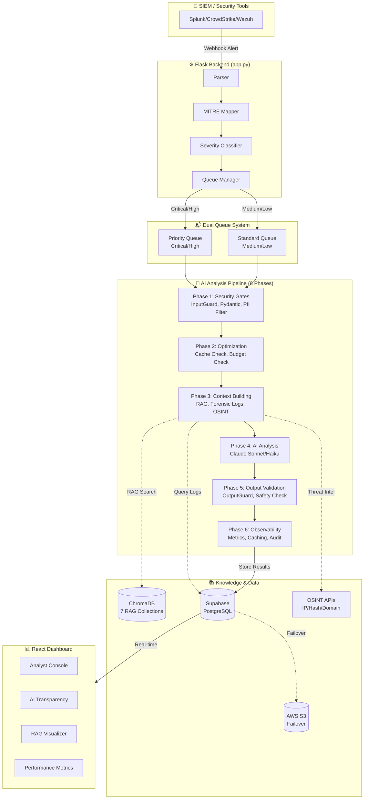

# AI-SOC Watchdog 🛡️

An AI-powered Security Operations Center (SOC) automation system that analyzes security alerts using Claude AI, providing intelligent triage, explainable verdicts, and real-time monitoring dashboards.


## 🎯 Problem Statement

Security teams are overwhelmed:
- **500+ alerts/day** per analyst
- **90% are false positives** - routine activity that looks suspicious
- **10% are real threats** - buried in noise
- **Alert fatigue** leads to missed attacks

## 💡 Solution

AI-SOC Watchdog acts as an intelligent first-responder:

1. **Receives alerts** from SIEM systems (Splunk, etc.)
2. **Gathers forensic evidence** (process, network, file, Windows logs)
3. **Queries threat intelligence** (OSINT: IP/hash/domain reputation)
4. **Retrieves relevant knowledge** (MITRE ATT&CK, historical alerts, business rules)
5. **Analyzes with AI** (Claude) using chain-of-thought reasoning
6. **Returns explainable verdicts** with evidence and recommendations

**Result**: Analysts review AI-enriched alerts 5-10x faster, focusing on real threats.

---

## 🏗️ Architecture



> 📖 See [docs/ARCHITECTURE.md](docs/ARCHITECTURE.md) for detailed component documentation.

---

## ✨ Key Features

### AI & Security
| Feature | Description |
|---------|-------------|
| **26 Security Features** | Input/output validation, PII filtering, prompt injection detection |
| **6-Phase AI Pipeline** | Security gates, optimization, context building, AI analysis, output validation, observability |
| **RAG Knowledge Retrieval** | 7 ChromaDB collections (MITRE, historical alerts, business rules) |
| **Analyst Feedback Loop** | Corrections improve future AI decisions via RAG context |
| **OSINT Integration** | IP, hash, domain reputation lookups |
| **Explainable AI** | Chain-of-thought reasoning with evidence in dashboard |
| **Cost Optimization** | Severity-based model selection (Sonnet for critical, Haiku for low - 90% cheaper) |

### Infrastructure
| Feature | Description |
|---------|-------------|
| **S3 Failover** | Database resilience - continues operating if Supabase is down |
| **Real-time Monitoring** | CPU, memory, AI costs, error tracking |
| **Dual Queue System** | Priority queue for critical alerts |
| **Background Workers** | Async processing with status tracking |

### Dashboard
| View | Purpose |
|------|---------|
| **Analyst Console** | Alert triage, investigation, notes |
| **AI Transparency** | Proof of AI analysis, evidence verification |
| **RAG Visualizer** | Knowledge base usage per alert |
| **Performance Metrics** | System health, AI costs, processing stats |
| **Debug Dashboard** | Live operation logs |

---

## 🚀 Quick Start

### Prerequisites
- Python 3.9+
- Node.js 18+
- Supabase account (free tier works)
- Anthropic API key (Claude)

### 1. Clone & Install

```bash
git clone https://github.com/YOUR_USERNAME/ai-soc-watchdog.git
cd ai-soc-watchdog

# Backend
pip install -r requirements.txt

# Frontend
cd soc-dashboard
npm install
cd ..
```

### 2. Configure Environment

Create `.env` in project root:

```env
# Required
ANTHROPIC_API_KEY=your_anthropic_key
SUPABASE_URL=your_supabase_url
SUPABASE_KEY=your_supabase_anon_key
SUPABASE_SERVICE_KEY=your_supabase_service_key

# Optional (for S3 failover)
AWS_ACCESS_KEY=your_aws_key
AWS_SECRET_KEY=your_aws_secret
AWS_REGION=us-east-1
S3_BUCKET=your_bucket_name
```

### 3. Initialize Database

Run the Supabase migrations or create tables:
- `alerts`
- `process_logs`
- `network_logs`
- `file_activity_logs`
- `windows_event_logs`

### 4. Seed RAG Knowledge Base

```bash
python backend/scripts/seeding/seed_rag.py
```

### 5. Start the Application

```bash
# Terminal 1: Backend
python app.py

# Terminal 2: Frontend
cd soc-dashboard
npm run dev
```

### 6. Open Dashboard

Navigate to `http://localhost:5173`

---

## 📁 Project Structure

```
ai-soc-watchdog/
├── app.py                      # Main Flask application
├── backend/
│   ├── ai/
│   │   ├── alert_analyzer_final.py  # 6-phase AI pipeline
│   │   ├── api_resilience.py        # Claude API client
│   │   ├── rag_system.py            # RAG knowledge retrieval
│   │   ├── security_guard.py        # Input/output validation
│   │   ├── osint_lookup.py          # Threat intelligence
│   │   └── ...
│   ├── core/
│   │   ├── parser.py               # Alert parsing
│   │   ├── mitre_mapping.py        # MITRE ATT&CK mapping
│   │   ├── Queue_manager.py        # Dual queue system
│   │   └── ...
│   ├── storage/
│   │   ├── database.py             # Supabase operations
│   │   └── s3_failover.py          # S3 failover system
│   └── monitoring/
│       ├── system_monitor.py       # Performance metrics
│       └── ...
├── soc-dashboard/              # React frontend
│   ├── src/
│   │   ├── pages/
│   │   │   ├── AnalystDashboard.jsx
│   │   │   ├── TransparencyDashboard.jsx
│   │   │   ├── RAGDashboard.jsx
│   │   │   └── PerformanceDashboard.jsx
│   │   └── ...
│   └── ...
├── scripts/                    # Utility scripts
│   ├── seed_test_logs.py
│   ├── test_volume_and_benign.py
│   └── test_s3_failover.py
├── tests/                      # Test suite
├── docs/                       # Documentation
└── requirements.txt
```

---

## 🧪 Testing

```bash
# Run all tests
python tests/run_all_tests.py --all

# Quick API tests only
python tests/run_all_tests.py --api

# Test S3 failover
python scripts/test_s3_failover.py

# Volume testing (100 alerts)
python scripts/test_volume_and_benign.py --volume 100

# False positive testing
python scripts/test_volume_and_benign.py --benign
```

---

## 💰 Cost Optimization

| Alert Severity | Model Used | Cost per Alert |
|---------------|------------|----------------|
| Critical/High | Claude Sonnet | ~$0.02 |
| Medium/Low | Claude Haiku | ~$0.002 |

**90% cost reduction** for routine alerts while maintaining quality for critical threats.

---

## 📊 API Endpoints

| Endpoint | Method | Description |
|----------|--------|-------------|
| `/ingest` | POST | Receive new alerts from SIEM |
| `/alerts` | GET | List all alerts |
| `/api/alerts/<id>` | PATCH | Update alert status/notes |
| `/api/alerts/<id>/feedback` | POST | Submit analyst feedback on AI verdict |
| `/api/alerts/<id>/reanalyze` | POST | Re-queue alert for AI analysis |
| `/api/feedback/stats` | GET | AI accuracy statistics from feedback |
| `/queue-status` | GET | Check processing queue |
| `/api/rag/stats` | GET | RAG system statistics |
| `/api/transparency/proof/<id>` | GET | AI analysis proof |
| `/api/monitoring/metrics/dashboard` | GET | System metrics |
| `/api/failover/status` | GET | S3 failover status |

---

## 🔒 Security Features

1. **Input Validation** - Blocks SQL injection, XSS, command injection
2. **Prompt Injection Detection** - Prevents AI manipulation attempts
3. **Output Validation** - Ensures AI responses are safe
4. **PII Filtering** - Redacts sensitive data before AI processing
5. **API Key Authentication** - Protects ingestion endpoint
6. **Rate Limiting** - Prevents abuse

---

## 📚 Documentation

- [AI Enhancements Guide](docs/AI_ENHANCEMENTS.md) - Structured prompting & feedback loop
- [Complete Alert Flow](docs/COMPLETE_ALERT_FLOW.md) - Every operation traced
- [Manual Testing Guide](docs/MANUAL_TESTING_GUIDE.md)
- [Non-Technical Explanation](docs/PROJECT_EXPLANATION_NON_TECHNICAL.md)
- [Technical Differentiators & Limitations](docs/TECHNICAL_DIFFERENTIATORS_AND_LIMITATIONS.md)
- [File Reference Guide](docs/FILE_REFERENCE_GUIDE.md)

---

## ⚠️ Limitations

- **Not a replacement for analysts** - Assists human decision-making
- **Requires quality logs** - AI accuracy depends on forensic data
- **API dependency** - Needs Anthropic API availability
- **No active response** - Analyzes only, doesn't isolate/block
- **English only** - Prompts and analysis in English

See [TECHNICAL_DIFFERENTIATORS_AND_LIMITATIONS.md](docs/TECHNICAL_DIFFERENTIATORS_AND_LIMITATIONS.md) for full details.

---

## 🛠️ Tech Stack

- **Backend**: Python, Flask, Supabase (PostgreSQL)
- **Frontend**: React, Vite, TailwindCSS, Recharts
- **AI**: Anthropic Claude (Sonnet/Haiku)
- **Knowledge Base**: ChromaDB (RAG)
- **Cloud**: AWS S3 (failover), Supabase

---

## 📄 License

MIT License - see [LICENSE](LICENSE) file.

---

## 👨‍💻 Author

Built as a demonstration of AI-augmented security operations.

---

## 🙏 Acknowledgments

- [Anthropic](https://anthropic.com) for Claude AI
- [MITRE ATT&CK](https://attack.mitre.org) for the attack framework
- [Supabase](https://supabase.com) for the database platform
