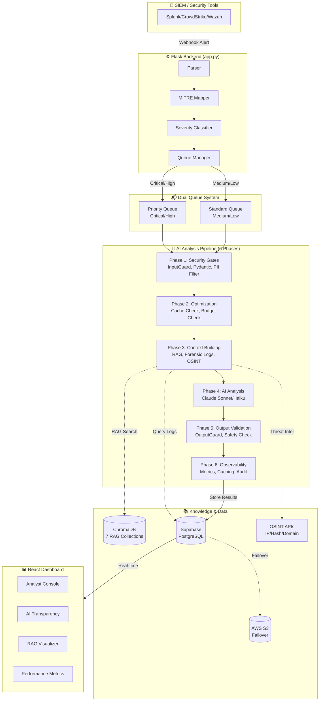

# AI-SOC Watchdog Architecture

## System Overview

## Component Details

### 1. Alert Ingestion Layer
- **Parser** (`backend/core/parser.py`): Normalizes SIEM formats (Splunk, Wazuh) into standard schema
- **MITRE Mapper** (`backend/core/mitre_mapping.py`): Maps alerts to MITRE ATT&CK techniques
- **Severity Classifier** (`backend/core/Severity.py`): Categorizes alerts as CRITICAL_HIGH or MEDIUM_LOW
- **Queue Manager** (`backend/core/Queue_manager.py`): Routes alerts to priority or standard queues

### 2. AI Analysis Pipeline (6 Phases)
1. **Security Gates** (`backend/ai/security_guard.py`): InputGuard validation, Pydantic schema, PII filtering
2. **Optimization** (`backend/ai/alert_analyzer_final.py`): Cache check, budget check
3. **Context Building** (`backend/ai/alert_analyzer_final.py`): RAG queries, forensic logs, OSINT enrichment
4. **AI Analysis** (`backend/ai/api_resilience.py`): Claude Sonnet (critical) or Haiku (low-sev) with retry logic
5. **Output Validation** (`backend/ai/security_guard.py`): OutputGuard safety checks, contradiction detection
6. **Observability** (`backend/ai/observability.py`): Metrics collection, result caching, audit logging

### 3. Knowledge & Storage
- **ChromaDB** (`backend/ai/rag_system.py`): 7 vector collections for RAG (MITRE, historical alerts, business rules)
- **Supabase** (`backend/storage/database.py`): Primary PostgreSQL database
- **AWS S3** (`backend/storage/s3_failover.py`): Failover storage for resilience
- **OSINT** (`backend/ai/osint_lookup.py`): IP, hash, domain reputation lookups

### 4. React Dashboard
- **Analyst Console**: Alert triage, investigation, notes
- **AI Transparency**: Proof of AI analysis, evidence verification
- **RAG Visualizer**: Knowledge base usage per alert
- **Performance Metrics**: System health, AI costs, processing stats

## Data Flow

1. SIEM sends alert via webhook to `/ingest`
2. Alert is parsed, mapped to MITRE, and classified by severity
3. Queue manager routes to priority (critical/high) or standard (medium/low) queue based on risk score
4. Background workers process alerts through 6-phase AI pipeline
5. Results stored in Supabase, displayed in React dashboard via real-time updates
