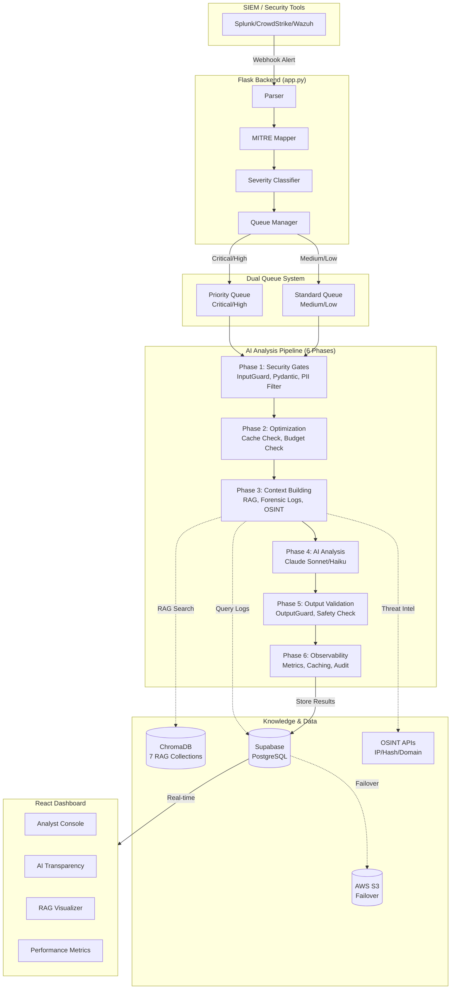

# AI-SOC Watchdog Architecture

## System Overview

## Components

### Alert Ingestion

| Component | File | Purpose |
|-----------|------|---------|
| Parser | `backend/core/parser.py` | Normalizes SIEM formats (Splunk, Wazuh) into a standard schema |
| MITRE Mapper | `backend/core/mitre_mapping.py` | Maps alerts to MITRE ATT&CK techniques |
| Severity Classifier | `backend/core/Severity.py` | Categorizes alerts as CRITICAL_HIGH or MEDIUM_LOW |
| Queue Manager | `backend/core/Queue_manager.py` | Routes alerts to priority or standard queues |

### AI Analysis Pipeline

| Phase | File | Purpose |
|-------|------|---------|
| 1. Security Gates | `backend/ai/security_guard.py` | Validates input, enforces schema, filters PII |
| 2. Optimization | `backend/ai/alert_analyzer_final.py` | Checks cache and budget before processing |
| 3. Context Building | `backend/ai/alert_analyzer_final.py` | Queries RAG, forensic logs, and OSINT |
| 4. AI Analysis | `backend/ai/api_resilience.py` | Calls Claude Sonnet (critical) or Haiku (low-sev) |
| 5. Output Validation | `backend/ai/security_guard.py` | Checks output safety, detects contradictions |
| 6. Observability | `backend/ai/observability.py` | Collects metrics, caches results, logs audit trail |

### Storage

| Component | File | Purpose |
|-----------|------|---------|
| ChromaDB | `backend/ai/rag_system.py` | Vector store with 7 collections for RAG |
| Supabase | `backend/storage/database.py` | Primary PostgreSQL database |
| AWS S3 | `backend/storage/s3_failover.py` | Backup storage when primary fails |
| OSINT | `backend/ai/osint_lookup.py` | IP, hash, and domain reputation lookups |

### Dashboard

| Component | Purpose |
|-----------|---------|
| Analyst Console | Alert triage, investigation, notes |
| AI Transparency | Shows AI analysis evidence |
| RAG Visualizer | Displays knowledge base usage per alert |
| Performance Metrics | System health, AI costs, processing stats |

## Data Flow

1. SIEM sends alert via webhook to `/ingest`
2. Parser normalizes the alert, MITRE Mapper adds technique IDs, Severity Classifier assigns risk
3. Queue Manager routes critical/high alerts to priority queue, medium/low to standard queue
4. Background workers process alerts through the 6-phase AI pipeline
5. Results are stored in Supabase and pushed to the dashboard via real-time updates
