# AI-SOC Watchdog Architecture

## System Overview

```mermaid
flowchart TB
    subgraph SIEM["🔔 SIEM / Security Tools"]
        splunk[Splunk/CrowdStrike/Wazuh]
    end

    subgraph Backend["⚙️ Flask Backend (app.py)"]
        direction LR
        parser[Parser]
        mitre[MITRE Mapper]
        severity[Severity Classifier]
        queue[Queue Manager]
        parser --> mitre --> severity --> queue
    end

    subgraph Queues["📬 Dual Queue System"]
        priority[Priority Queue<br/>Critical/High]
        standard[Standard Queue<br/>Medium/Low]
    end

    subgraph AI["🤖 AI Analysis Pipeline"]
        direction TB
        phase1[Phase 1: Security Gates<br/>Input Validation, PII Filter]
        phase2[Phase 2: Context Building<br/>Supabase Logs, OSINT, RAG]
        phase3[Phase 3: AI Analysis<br/>Claude Sonnet/Haiku]
        phase4[Phase 4: Output Validation<br/>Response Safety Check]
        phase5[Phase 5: Auto-Triage<br/>Auto-close Benign]
        phase1 --> phase2 --> phase3 --> phase4 --> phase5
    end

    subgraph Knowledge["📚 Knowledge & Data"]
        chromadb[(ChromaDB<br/>7 RAG Collections)]
        supabase[(Supabase<br/>PostgreSQL)]
        s3[(AWS S3<br/>Failover)]
        osint[OSINT APIs<br/>IP/Hash/Domain]
    end

    subgraph Dashboard["📊 React Dashboard"]
        analyst[Analyst Console]
        transparency[AI Transparency]
        rag_viz[RAG Visualizer]
        perf[Performance Metrics]
    end

    splunk -->|Webhook Alert| parser
    queue -->|Critical/High| priority
    queue -->|Medium/Low| standard
    priority --> phase1
    standard --> phase1
    phase2 -.->|Query Logs| supabase
    phase2 -.->|Threat Intel| osint
    phase2 -.->|RAG Search| chromadb
    phase5 -->|Store Results| supabase
    supabase -.->|Failover| s3
    supabase -->|Real-time| Dashboard
```

## Component Details

### 1. Alert Ingestion Layer
- **Parser** (`backend/core/parser.py`): Normalizes SIEM formats (Splunk, Wazuh) into standard schema
- **MITRE Mapper** (`backend/core/mitre_mapping.py`): Maps alerts to MITRE ATT&CK techniques
- **Severity Classifier** (`backend/core/Severity.py`): Categorizes alerts as CRITICAL_HIGH or MEDIUM_LOW
- **Queue Manager** (`backend/core/Queue_manager.py`): Routes alerts to priority or standard queues

### 2. AI Analysis Pipeline (6 Phases)
1. **Security Gates** (`backend/ai/security_guard.py`): Input validation, prompt injection detection, PII filtering
2. **Context Building** (`backend/ai/alert_analyzer_final.py`): Gathers forensic logs, OSINT enrichment, RAG queries
3. **AI Analysis** (`backend/ai/alert_analyzer_final.py`): Claude Sonnet (critical) or Haiku (low-sev) analysis
4. **Output Validation** (`backend/ai/security_guard.py`): Response safety checks
5. **Auto-Triage**: Auto-closes benign low-risk alerts

### 3. Knowledge & Storage
- **ChromaDB** (`backend/ai/rag_system.py`): 7 vector collections for RAG (MITRE, historical alerts, business rules)
- **Supabase** (`backend/storage/database.py`): Primary PostgreSQL database
- **AWS S3** (`backend/storage/s3_failover.py`): Failover storage for resilience
- **OSINT** (`backend/ai/osint_lookup.py`): IP, hash, domain reputation lookups

### 4. React Dashboard
- **Analyst Console**: Alert triage, investigation, notes
- **AI Transparency**: Proof of AI analysis, evidence verification
- **RAG Visualizer**: Knowledge base usage per alert
- **Performance Metrics**: System health, AI costs, processing stats

## Data Flow

1. SIEM sends alert via webhook to `/ingest`
2. Alert is parsed, mapped to MITRE, and classified by severity
3. Queue manager routes to priority (critical/high) or standard (medium/low) queue
4. Background workers process alerts through 6-phase AI pipeline
5. Results stored in Supabase, displayed in React dashboard
6. Auto-triage closes benign low-risk alerts automatically
