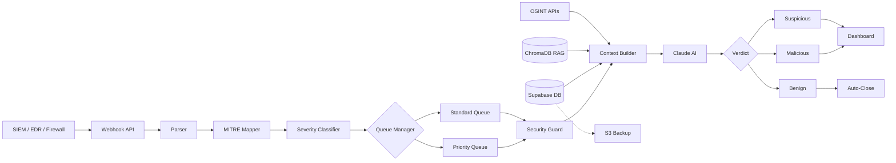
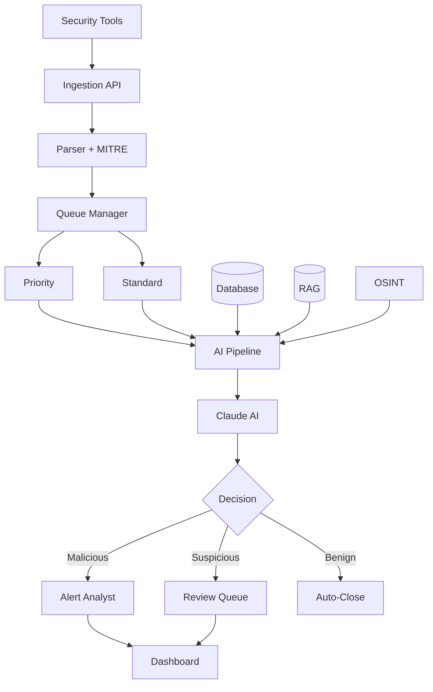
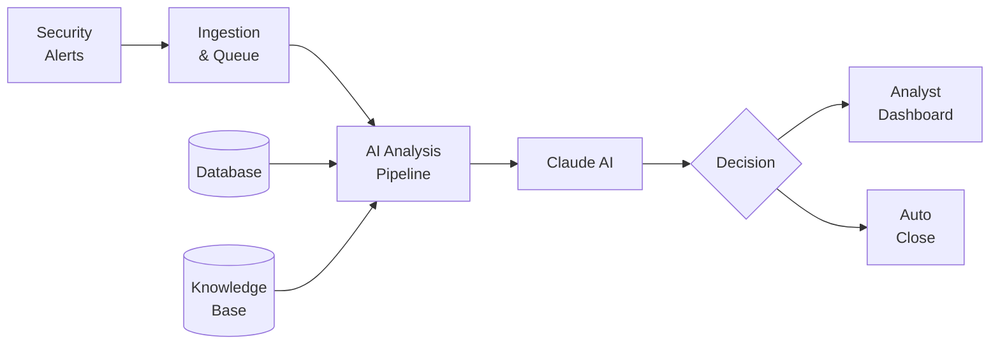
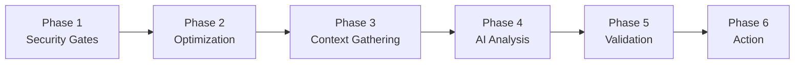
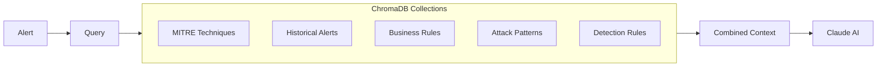
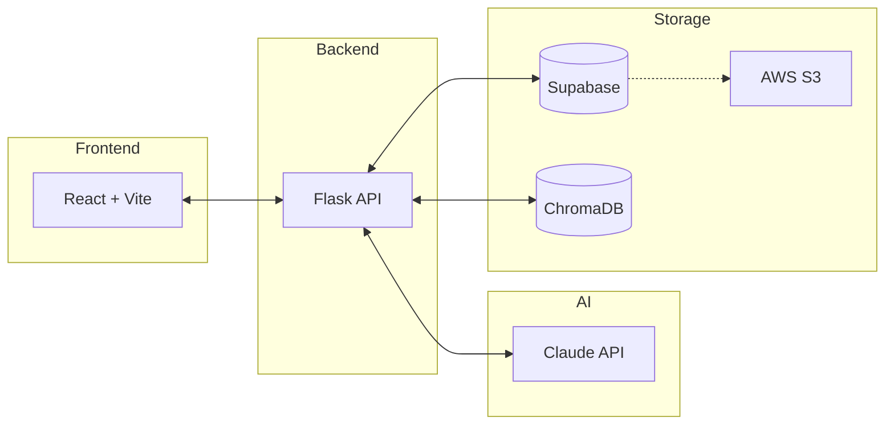

# Architecture Diagrams

Supplementary diagrams for presentations and documentation. Copy any diagram to [mermaid.live](https://mermaid.live) to generate PNG/SVG exports.

## Linear Flow (Left to Right)

## Vertical Flow

## Simple Overview

## AI Pipeline Phases

## RAG Knowledge Base

## Tech Stack

