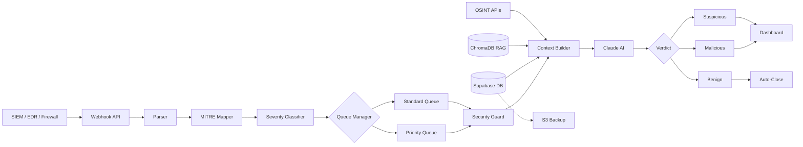
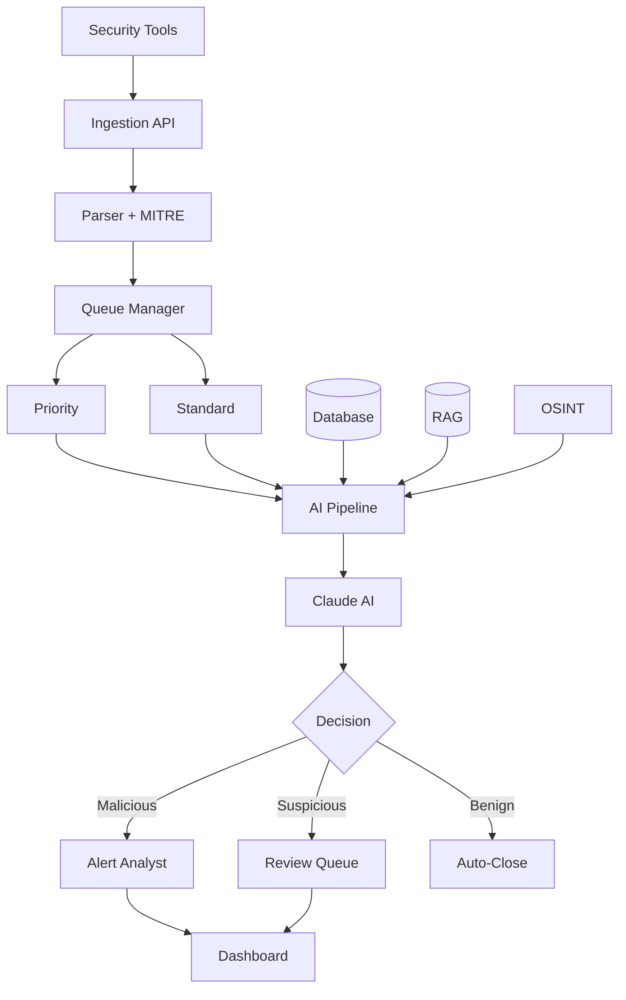
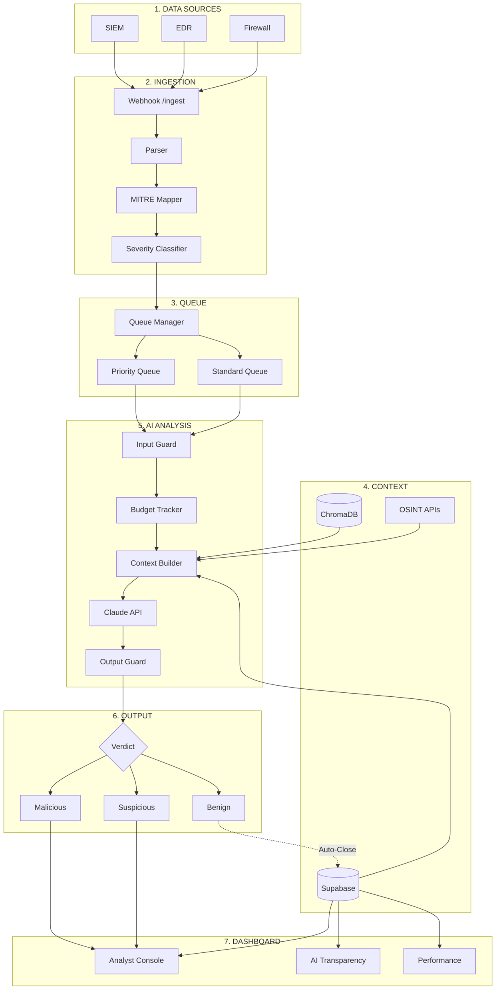
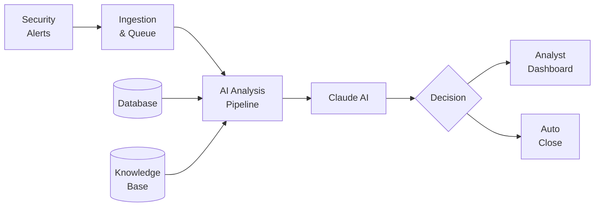
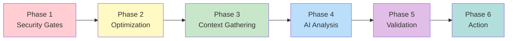
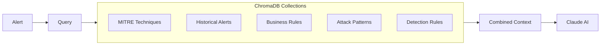
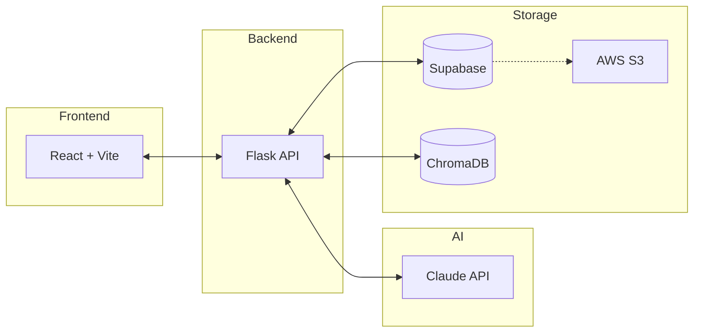

# Architecture Diagram - AI-SOC Watchdog

## How to Generate the Diagram

1. Go to **https://mermaid.live**
2. Delete everything in the code panel
3. Paste one of the diagrams below
4. Click **Actions** (top right) → **Download PNG**

---

## RECOMMENDED: Clean Linear Diagram (Copy This)

---

## Alternative: Vertical Flow (Top to Bottom)

---

## Detailed Version with All Components

---

## Simple Overview (Best for Presentations)

---

## 6-Phase AI Pipeline (Horizontal)

---

## RAG Knowledge Base

---

## Tech Stack Summary

