# Architecture Diagram - AI-SOC Watchdog

## How to Generate the Diagram

### Option 1: Mermaid (GitHub renders this automatically)
Copy the code below into any `.md` file on GitHub, or use https://mermaid.live

### Option 2: Use https://mermaid.live
1. Go to https://mermaid.live
2. Paste the code below
3. Click "Download PNG" or "Download SVG"

---

## Main System Architecture

```mermaid
flowchart TB
    subgraph SOURCES["🔒 SECURITY DATA SOURCES"]
        SIEM["SIEM Systems<br/>(Splunk, QRadar)"]
        EDR["EDR Tools<br/>(CrowdStrike, Defender)"]
        FW["Firewalls & IDS<br/>(Palo Alto, Snort)"]
    end

    subgraph INGESTION["📥 ALERT INGESTION"]
        WEBHOOK["Webhook Endpoint<br/>/ingest"]
        PARSER["Alert Parser<br/>parser.py"]
        MITRE["MITRE Mapper<br/>mitre_mapping.py"]
        SEVERITY["Severity Classifier<br/>Severity.py"]
    end

    subgraph QUEUE["📋 QUEUE SYSTEM"]
        QM["Queue Manager<br/>Queue_manager.py"]
        PQ["🔴 Priority Queue<br/>CRITICAL/HIGH"]
        SQ["🟡 Standard Queue<br/>MEDIUM/LOW"]
    end

    subgraph CONTEXT["🔍 CONTEXT GATHERING"]
        SUPABASE["Supabase DB<br/>PostgreSQL"]
        LOGS["Forensic Logs<br/>Process | Network | File | Windows"]
        OSINT["OSINT Lookup<br/>osint_lookup.py"]
        RAG["RAG System<br/>rag_system.py"]
        CHROMA["ChromaDB<br/>7 Collections"]
    end

    subgraph AI["🤖 AI ANALYSIS PIPELINE"]
        GUARD_IN["Input Guard<br/>security_guard.py"]
        BUDGET["Budget Tracker<br/>dynamic_budget_tracker.py"]
        CONTEXT_BUILD["Context Builder<br/>alert_analyzer_final.py"]
        CLAUDE["Claude AI<br/>Sonnet / Haiku"]
        GUARD_OUT["Output Guard<br/>security_guard.py"]
        AUTO["Auto-Triage<br/>Benign → Auto-close"]
    end

    subgraph DASHBOARD["📊 REACT DASHBOARD"]
        ANALYST["Analyst Console<br/>Alert Triage"]
        TRANSPARENCY["AI Transparency<br/>Proof & Evidence"]
        RAGVIZ["RAG Visualizer<br/>Knowledge Usage"]
        PERF["Performance<br/>System Metrics"]
        DEBUG["Debug Dashboard<br/>Live Logs"]
    end

    subgraph BACKUP["☁️ FAILOVER"]
        S3["AWS S3<br/>Backup Storage"]
    end

    %% Connections
    SIEM --> WEBHOOK
    EDR --> WEBHOOK
    FW --> WEBHOOK
    
    WEBHOOK --> PARSER
    PARSER --> MITRE
    MITRE --> SEVERITY
    SEVERITY --> QM
    
    QM --> PQ
    QM --> SQ
    
    PQ --> GUARD_IN
    SQ --> GUARD_IN
    
    SUPABASE --> LOGS
    LOGS --> CONTEXT_BUILD
    OSINT --> CONTEXT_BUILD
    RAG --> CHROMA
    CHROMA --> CONTEXT_BUILD
    
    GUARD_IN --> BUDGET
    BUDGET --> CONTEXT_BUILD
    CONTEXT_BUILD --> CLAUDE
    CLAUDE --> GUARD_OUT
    GUARD_OUT --> AUTO
    AUTO --> SUPABASE
    
    SUPABASE --> ANALYST
    SUPABASE --> TRANSPARENCY
    SUPABASE --> RAGVIZ
    SUPABASE --> PERF
    SUPABASE --> DEBUG
    
    SUPABASE -.->|Sync| S3

    %% Styling
    classDef sources fill:#e1f5fe,stroke:#01579b
    classDef ingestion fill:#fff3e0,stroke:#e65100
    classDef queue fill:#fce4ec,stroke:#880e4f
    classDef context fill:#e8f5e9,stroke:#1b5e20
    classDef ai fill:#f3e5f5,stroke:#4a148c
    classDef dashboard fill:#e0f2f1,stroke:#004d40
    classDef backup fill:#eceff1,stroke:#37474f

    class SIEM,EDR,FW sources
    class WEBHOOK,PARSER,MITRE,SEVERITY ingestion
    class QM,PQ,SQ queue
    class SUPABASE,LOGS,OSINT,RAG,CHROMA context
    class GUARD_IN,BUDGET,CONTEXT_BUILD,CLAUDE,GUARD_OUT,AUTO ai
    class ANALYST,TRANSPARENCY,RAGVIZ,PERF,DEBUG dashboard
    class S3 backup
```



---

## AI Analysis Pipeline Detail


---

## Data Flow Diagram

```mermaid
flowchart TD
    ALERT["🚨 Security Alert"]
    
    ALERT --> PARSE["Parse & Normalize"]
    PARSE --> CLASSIFY["Classify Severity"]
    CLASSIFY --> ROUTE{"Route by Risk Score"}
    
    ROUTE -->|"Risk ≥ 75"| PRIORITY["Priority Queue"]
    ROUTE -->|"Risk < 75"| STANDARD["Standard Queue"]
    
    PRIORITY --> GATHER["Gather Evidence"]
    STANDARD --> GATHER
    
    GATHER --> DB[(Supabase)]
    GATHER --> OSINT["OSINT APIs"]
    GATHER --> KNOWLEDGE[(ChromaDB)]
    
    DB --> BUILD["Build Context"]
    OSINT --> BUILD
    KNOWLEDGE --> BUILD
    
    BUILD --> CLAUDE["🤖 Claude AI"]
    
    CLAUDE --> VERDICT{"Verdict?"}
    
    VERDICT -->|"Malicious"| CRITICAL["🔴 Show to Analyst"]
    VERDICT -->|"Suspicious"| REVIEW["🟡 Review Required"]
    VERDICT -->|"Benign + High Conf"| AUTO["🟢 Auto-Close"]
    
    CRITICAL --> DASHBOARD["📊 Dashboard"]
    REVIEW --> DASHBOARD
    AUTO --> HISTORY["📁 History"]
    
    style ALERT fill:#ff5722,color:#fff
    style CLAUDE fill:#9c27b0,color:#fff
    style CRITICAL fill:#f44336,color:#fff
    style REVIEW fill:#ff9800,color:#fff
    style AUTO fill:#4caf50,color:#fff
```



---

## RAG Knowledge Collections


---

## Quick Copy-Paste for mermaid.live

Go to https://mermaid.live and paste this simplified version:

```
flowchart TB
    SIEM["🔒 SIEM/EDR"] --> INGEST["📥 Ingestion API"]
    INGEST --> PARSE["Parser + MITRE Mapper"]
    PARSE --> QUEUE["📋 Queue Manager"]
    
    QUEUE --> PQ["🔴 Priority Queue"]
    QUEUE --> SQ["🟡 Standard Queue"]
    
    PQ --> AI["🤖 AI Pipeline"]
    SQ --> AI
    
    DB[(Supabase)] --> AI
    RAG[(ChromaDB RAG)] --> AI
    OSINT["🌐 OSINT"] --> AI
    
    AI --> CLAUDE["Claude AI<br/>Sonnet/Haiku"]
    CLAUDE --> VERDICT{"Verdict"}
    
    VERDICT --> MAL["🔴 Malicious"]
    VERDICT --> SUS["🟡 Suspicious"]  
    VERDICT --> BEN["🟢 Benign"]
    
    MAL --> DASH["📊 Dashboard"]
    SUS --> DASH
    BEN --> AUTO["Auto-Close"]
    
    DASH --> ANALYST["Analyst Console"]
    DASH --> TRANS["AI Transparency"]
    DASH --> PERF["Performance"]
    
    DB -.-> S3["☁️ S3 Backup"]
```

---

## PlantUML Version (Alternative)

If you prefer PlantUML, use https://www.plantuml.com/plantuml/uml/


